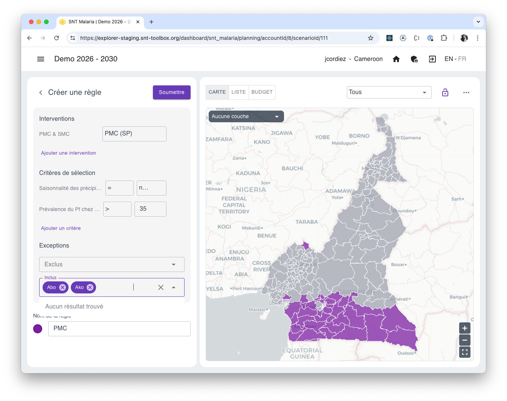
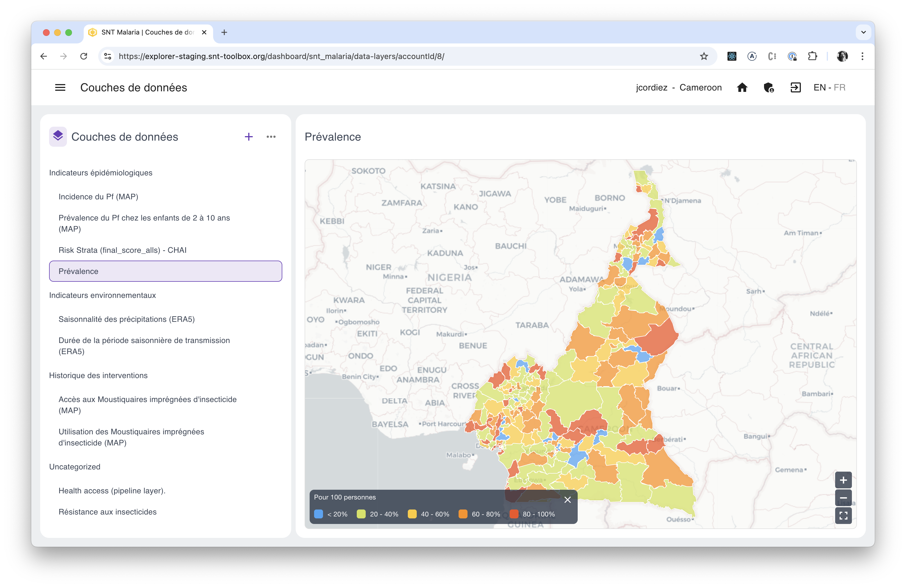

# Créer un plan d'interventions

Dans le SNT Explorer, la création d’un plan passe par la définition de règles, par lesquelles vous allez définir quelles interventions appliquer dans quelles circonstances.
Découvrez dans la vidéo ci-dessous comment créer votre premier plan :

<iframe src="https://www.loom.com/embed/9035d636eeb4419e920291c7be6a7917" frameborder="0" webkitallowfullscreen mozallowfullscreen allowfullscreen style="position: absolute; top: 0; left: 0; width: 100%; height: 100%;"></iframe>

## Etapes
### 1. Créer un nouveau plan

Depuis l'écran d'accueil de l'application, à savoir la liste de Scénarios, cliquer sur **Créer un Scénario**, nommez ce nouveau scénario, et définissez la période que celui-ci concerne

### 2. Créer une première règle

Dans le panneau de gauche, cliquez sur **+** pour créer votre première règle.
Choisissez ensuite d'abord les interventions à appliquer, avant de définir les critères à utiliser.
Vous pouvez choisir d'appliquer les interventions partout (cocher "Toutes les unités d'organisation"), ou en fonction de critères que pouvez librement cumuler. 

Enfin, vous pouvez également définir des exceptions, afin d'exclure ou d'inclure certains districts de la sélection.
Ceci est utile, si par exmple, si vous savez qu'un certain district devrait être inclus, mais que les données disponibles sont insuffisantes que pour que les critères s'appliquent. Ou bien, si les contraintes opérationnelles rendront l'intervention inutile ou inapplicable.

Dans cet exemple, nous avons créé une règle pour l'application de la chemo-prévention pérenniale (PMC), là où :
- les précipitations ne sont pas saisonnières 
- La prévalence est supérieur à 35
- En incluant également Abo et Ako.

### 3. Combiner plusieurs règles
Une fois cette nouvelle règle définie, cliquer sur **Soumettre** pour revenir à la liste des interventions, et ajouter d'autres règles.
Vous pouvez définir autant de règles que souhaité.
Ces règles s'additionnent, de haut en bas.
Vous pouvez modifier l'ordre de vos règles simplement par glisser-déposer.

L'ordre d'application des règles devient important lorsque vous définissez des règles prévoyant des interventions qui sont mutuellement exclusives, comme par exemple la PMC et la SMC.
Si par exemple vous avez une première règle qui applique de la PMC partout, et qu'ensuite pour définissez une seconde règle stipulant qu'il faut distribuer de la SMC dans les districts avec une saisonnalité importante, la règle "PMC" ne sera pas appliquée là où la règle "SMC" s'applique.
Par contre, si vous modifiez l'ordre des règles et que la SMC est appliquée d'abord, la règle PMC l'écrasera ensuite et aucun district ne recevra de SMC.

### 4. Valider une règle visuellement
Il peut être utile, lorsque l'on définit des règles, de comparer celles-ci avec les couches de données, afin de vérifier par exemple si la règle inclut bien les districts souhaités.
Pour cela, sélectionnez une règle, et utilisez le menu déroulant en haut à gauche de la carte pour afficher la couche à comparer. 

